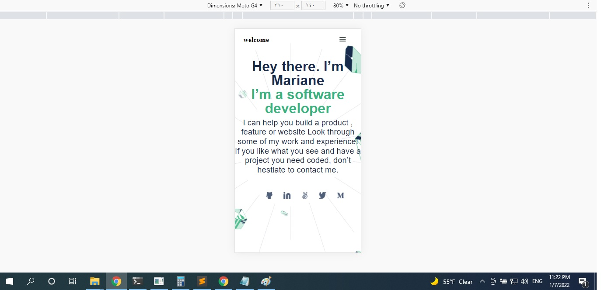
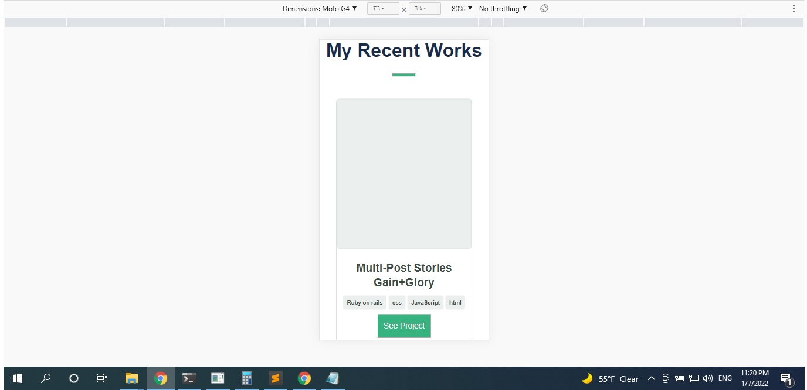
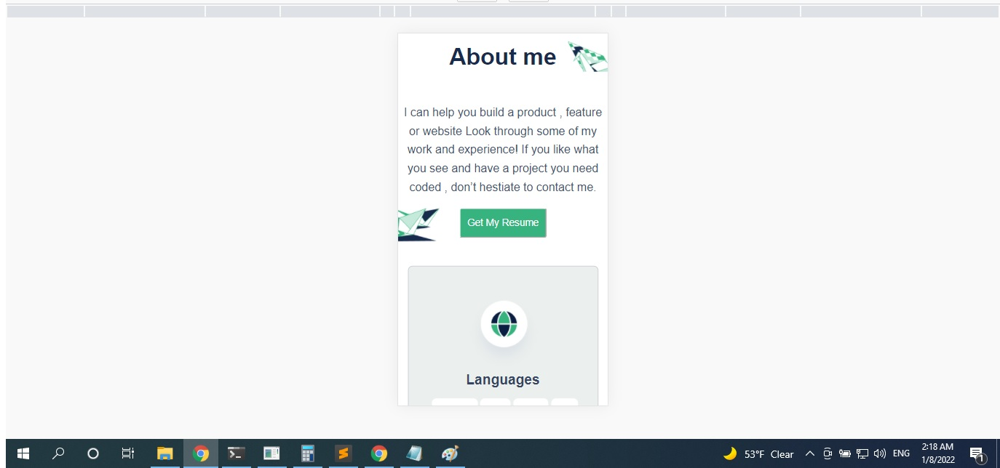
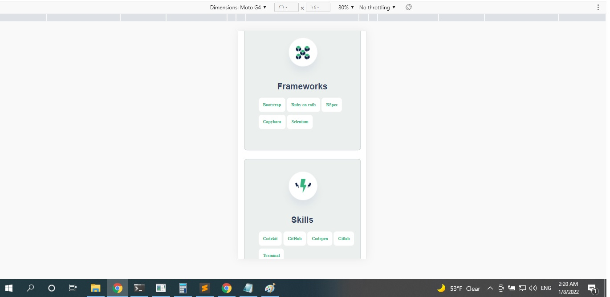
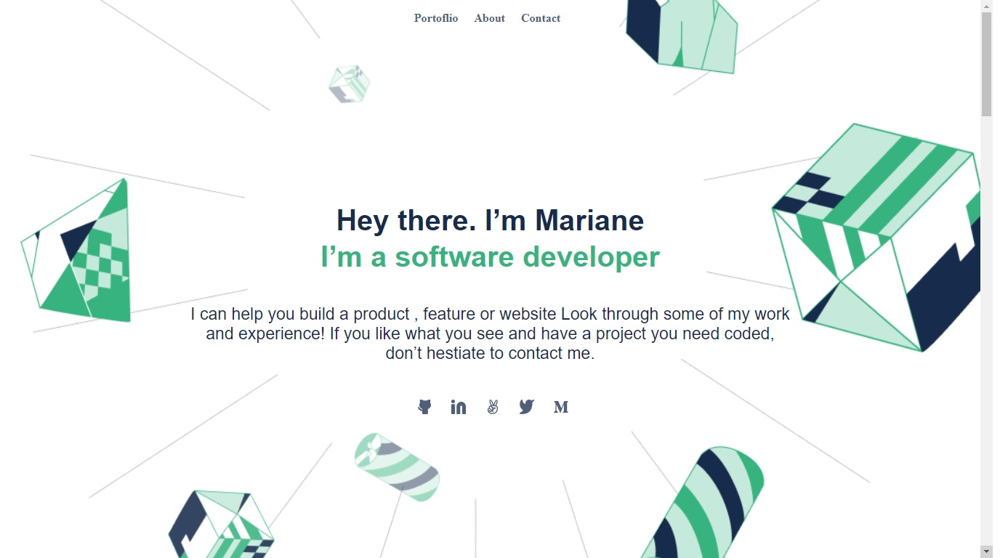
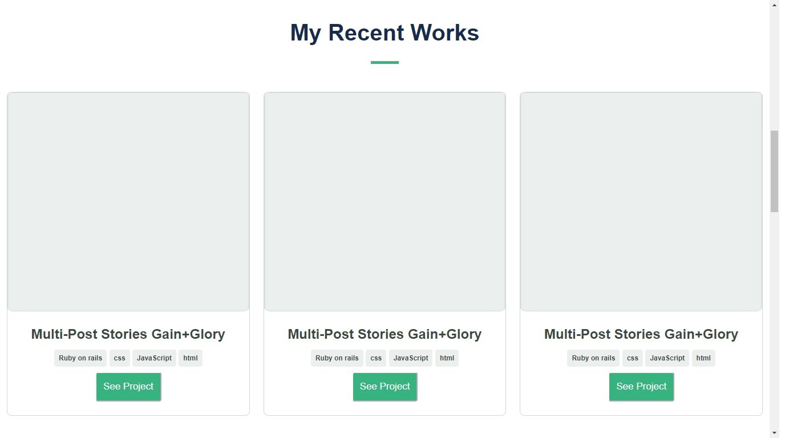
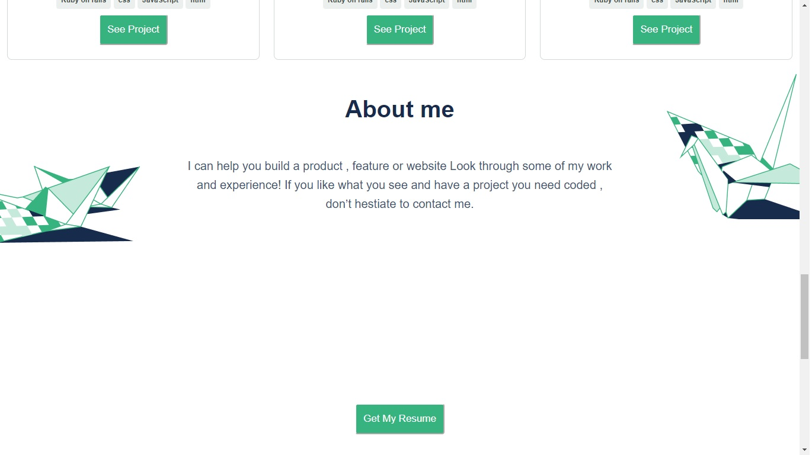
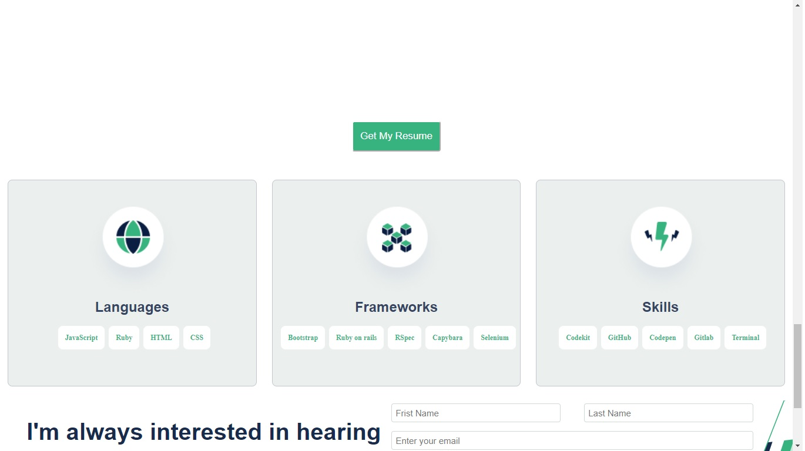
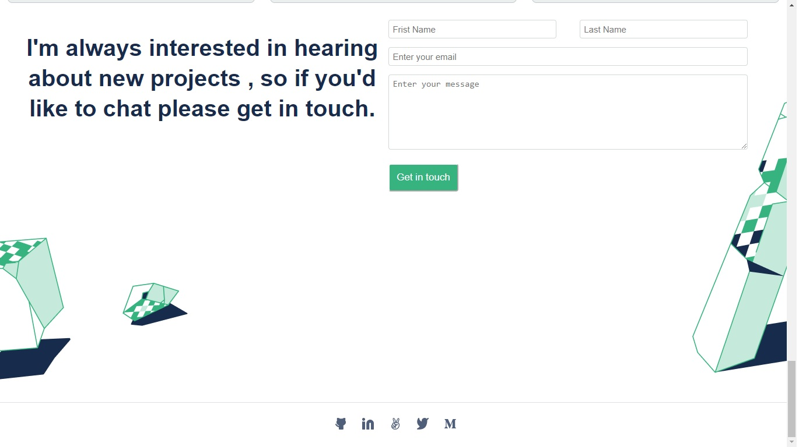

# mobile version skeleton

> portofolio page that is responsive to desktop&mobile.

navbar&headline section :

works section :

About section :

Footer section :

desktop version :

fourth project at mcroverse desktop version of potofolio :

 adjusting the pootofolio to be viewed on mobile&desktop.

## Built With

- HTML
- CSS
- liners for testing

## Live Demo

[Live Demo Link](https://saied2035.github.io/mobile-version-skeleton/)

## Getting Started

To get a local copy up and running follow these simple example steps.

### Install
 
 after cloning the repo run 
 `npm install`

### Usage
   run 
   `python -m http.sever`
### Run tests
   `npx hint .` for html check. giving hints about what is needed to and to your html page
   `npx stylelint "**/*.{css,scss}"` for css check
   `npx stylelint "**/*.{css,scss}" --fix` to fix css isues if found

## Authors

👤 **Saied Gaffer**

- GitHub: [@Saied2035](https://github.com/saied2035)
- Twitter: [@SaiedGaffer](https://twitter.com/SaiedGaffer)
- LinkedIn: [LinkedIn](https://www.linkedin.com/in/saiedgaffer/)

## 🤝 Contributing

Contributions, issues, and feature requests are welcome!

Feel free to check the [issues page](https://github.com/saied2035/mobile-version-skeleton/issues).

## Show your support

Give a ⭐️ if you like this project!

## Acknowledgments

- Microverse: [microverse community](https://github.com/microverseinc)
- My partner: [Rahal Mehdi Abdelaziz](https://github.com/Mehdi-Rh)

## 📝 License

This project is [MIT](./MIT.md) licensed.
